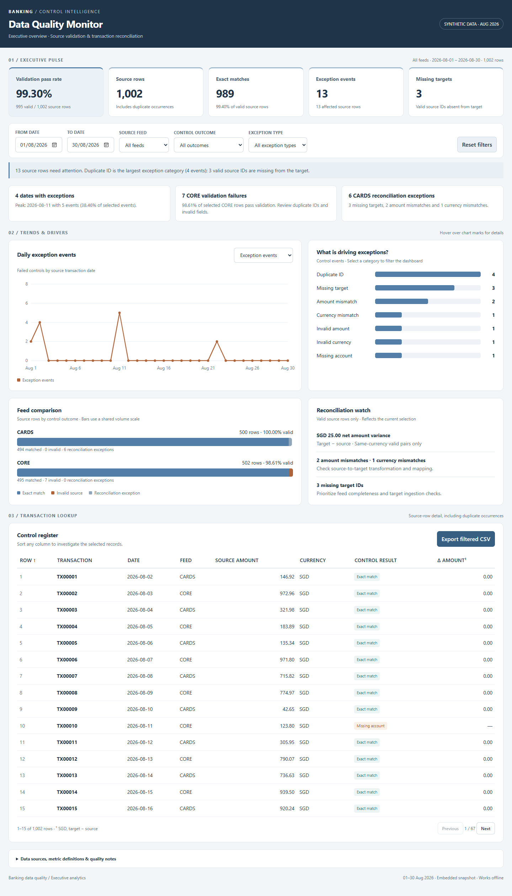

# Banking Data Quality Monitor

An interactive executive dashboard for source validation and transaction reconciliation, built with Python, HTML, CSS and JavaScript with AI assistance.

**All data is synthetic.** This is a portfolio and reporting-readiness prototype, not a regulatory submission.

[**View live dashboard**](https://slng09.github.io/banking-data-quality-project/)

Browse the Python pipeline and dashboard builder in [src](src/), analytical queries in [sql](sql/), automated checks in [tests](tests/), synthetic records in [data](data/), and output tables in [reports](reports/).



## Preview
Download the repository and open `index.html` in a modern browser. The dashboard is self-contained and works offline, with no installation required.

## Key findings
| Metric | Result |
|---|---:|
| Source rows | 1,002 |
| Valid source rows | 995 |
| Validation pass rate | 99.30% |
| Exact matches | 989 |
| Exception events | 13 |
| Missing target IDs | 3 |

CORE accounts for all seven source-validation failures. CARDS accounts for all six reconciliation exceptions. Exceptions occur on four dates; August 11 has the highest count (five). Two amount mismatches produce SGD 25.00 net target-minus-source variance; one additional record has a currency mismatch.

## Explore the dashboard
- Five KPI cards arranged above trends and comparisons.
- Inclusive date, feed, control-outcome and exception-type filters.
- Switchable line chart for daily exception events or transaction volume.
- Clickable exception-category bars and stacked feed comparisons.
- Sortable, paginated transaction register and filtered CSV download.
- Responsive desktop/mobile layout and embedded metric definitions.

Product and region fields are absent from the source data, so they are not offered as filters.

## Reproduce
Requires Python 3.10 or later; only the standard library is used.

```sh
python src/build_dashboard.py
```

This recalculates controls from the raw transaction pair, verifies key totals against the daily, feed and exception reports, and rebuilds `index.html`.

## Methodology
Source rows fail validation if their transaction ID is duplicated anywhere in the full source file, account is blank, currency is not SGD, or amount is nonpositive. Both occurrences of a duplicated ID fail. Invalid rows do not proceed to reconciliation. Valid source rows match when target ID, amount and currency agree. Amounts use integer cents.

Validation pass rate divides valid rows by source rows. Exact-match rate divides matches by valid rows. Exception events count failed controls, not distinct IDs. The 13 affected source rows represent 11 distinct IDs. Filters change selected denominators but do not change the original control classifications.

## Source quality correction
The supplied archive contained two different dataset versions. This project uses only `source_transactions.csv` and `target_transactions.csv`, the pair referenced by its original pipeline. The supplied summary JSON reported 990 matches, two missing targets and 12 events; recalculation yields 989, three and 13, matching the daily, feed and exception-detail reports. The original metrics.json and legacy datasets are retained for provenance. The current dashboard and the transaction-level daily/feed/detail reports use the corrected figures above. The original test_project.py checks the legacy metrics/database; test_pipeline.py checks the current pipeline. Do not combine the two dataset versions.

## Files
- `index.html`: complete dashboard and static website entry point.
- `src/`: reproducible Python builder and HTML template.
- `data/`: synthetic source and target records.
- `reports/`: daily/feed summaries, exception detail and original legacy metrics.

## Publishing
The root `index.html` can be hosted by a static website provider. For GitHub Pages, publish the repository root from the selected branch. No build step is required. The live dashboard is published with GitHub Pages from the root index.html.


## Original project

The unzipped project files are included in their original folders. `python src/run.py` regenerates the current synthetic pipeline and the original static dashboard in `dashboard/`. `python src/build_dashboard.py` rebuilds the interactive root dashboard. The original case study and Power BI guide are included as supporting documents; their legacy metrics references should be interpreted using the correction above. No .pbix file is included.


